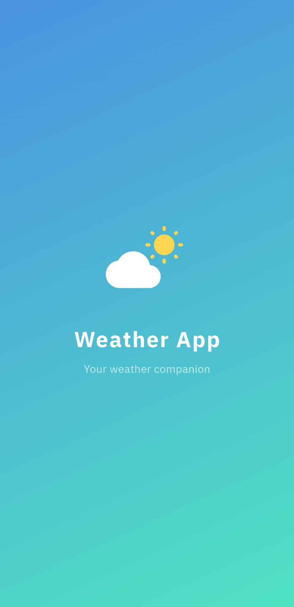
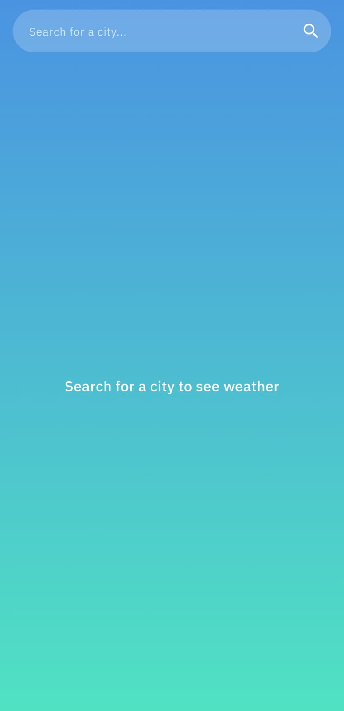
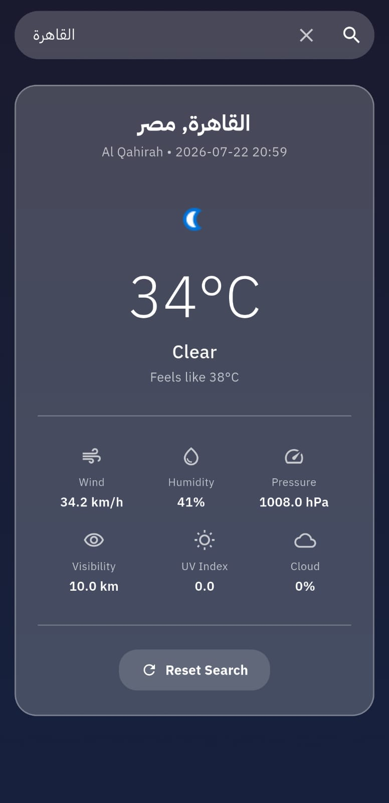
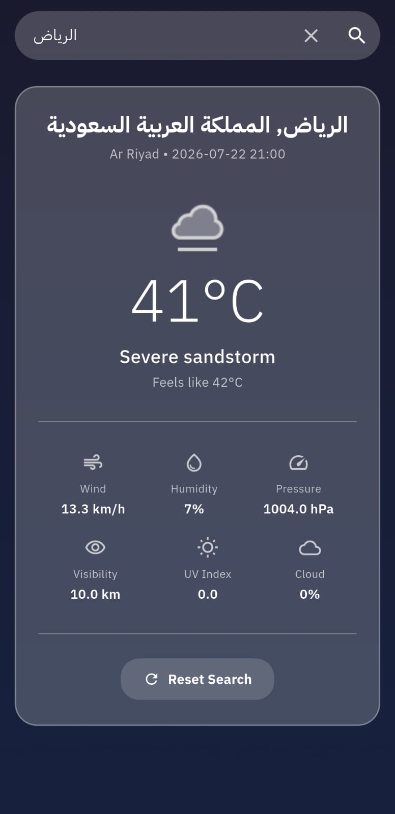
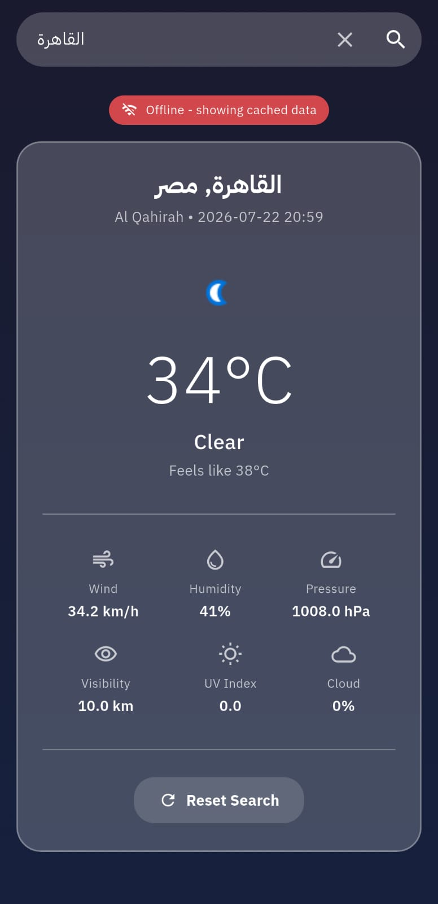

# Weather App 🌤️

A robust Flutter weather application that fetches and displays real-time weather information for any city worldwide,
built with clean architecture principles and BLoC state management.

## 🚀 Features

- **Live Weather Data**: Search any city and get real-time weather conditions from WeatherAPI.
- **Offline Caching**: Automatically caches the last searched weather data for offline viewing.
- **Reset Search**: A reset button clears the loaded weather data, input fields, and cached state to start a clean
  search.
- **Security & Configuration**: Loads API credentials securely from a `.env` file at runtime.
- **Clean Architecture**: Well-organized project structure with separation of concerns.
- **State Management**: BLoC/Cubit pattern for predictable and testable state management.
- **Dependency Injection**: GetIt for efficient service management.
- **Internationalization**: Multi-language support (English & Arabic) with Easy Localization.
- **Responsive Design**: Adaptive UI using Flutter ScreenUtil for all screen sizes.
- **Navigation**: Declarative routing with Go Router.
- **Premium UI**: Glassmorphism cards, dynamic gradients (day/night), and smooth animations.
- **Error Handling**: Comprehensive error management with user-friendly messages.
- **Theme System**: Dynamic theming with dark/light mode support.

---

## 📱 Screenshots & Adding Media

The app features:

- **Splash Screen**: Animated weather icon with cloud and sun, auto-navigates to main screen.
- **Weather Dashboard**: Immersive gradient background, glassmorphism weather card, city search.
- **Offline Mode**: Red banner indicator when showing cached data.
- **Reset Controls**: Easily clear search query/data to start over.

### 📸 How to Add Screenshots to this README

To display screenshots in this file, follow these simple steps:

1. **Capture Screenshots**:
   Take screenshots or recordings of the app on your emulator or real device.

2. **Save Images in the Workspace**:
   Create a dedicated screenshots directory inside the assets folder:
   ```bash
   mkdir assets/screenshots
   ```
   Save your images there (e.g., `splash.png`, `dashboard.png`, `offline.png`).

3. **Link Screenshots in Markdown**:
   Use standard Markdown image syntax to link them:
   ```markdown
   
   
   
   
   
   ```

4. **Optionally side-by-side (using HTML table)**:
   ```html
   <p align="center">
     
     
     
     
     
   </p>
   ```

---

## 🏗️ Tech Stack

### Core Dependencies

- **Flutter SDK**: ^3.8.1
- **State Management**: [flutter_bloc](https://pub.dev/packages/flutter_bloc) ^9.1.1
- **Environment Configuration**: [flutter_dotenv](https://pub.dev/packages/flutter_dotenv) ^6.0.1
- **Routing**: [go_router](https://pub.dev/packages/go_router) ^17.0.0
- **Dependency Injection**: [get_it](https://pub.dev/packages/get_it) ^9.2.0
- **Networking**: [dio](https://pub.dev/packages/dio) ^5.9.2
- **Localization**: [easy_localization](https://pub.dev/packages/easy_localization) ^3.0.8
- **Functional Programming**: [dartz](https://pub.dev/packages/dartz) ^0.10.1

### UI & Utilities

- **Responsive Design**: [flutter_screenutil](https://pub.dev/packages/flutter_screenutil) ^5.9.3
- **Data Models**: [equatable](https://pub.dev/packages/equatable) ^2.0.8

### Storage & Caching

- **Local Storage**: [shared_preferences](https://pub.dev/packages/shared_preferences) ^2.5.3
- **Secure Storage**: [flutter_secure_storage](https://pub.dev/packages/flutter_secure_storage) ^10.0.0

### Development Tools

- **Code Quality**: [flutter_lints](https://pub.dev/packages/flutter_lints) ^5.0.0
- **Network Logging**: [pretty_dio_logger](https://pub.dev/packages/pretty_dio_logger) ^1.4.0

---

## 🏗️ Project Structure

```
lib/
├── main.dart                          # App entry point (loads dotenv configs)
└── src/
    ├── core/                          # Core utilities and shared components
    │   ├── components/                # Reusable UI components
    │   ├── constants/                 # App constants (names, cache keys)
    │   ├── extensions/                # Dart extensions
    │   ├── helpers/                   # Helper utilities
    │   ├── language/                  # Internationalization setup
    │   ├── navigation/                # GoRouter routing configuration
    │   │   ├── app_router.dart        # Route tree & navigation helpers
    │   │   └── app_routes.dart        # Route path constants
    │   ├── network/                   # Network & API layer
    │   │   ├── api_endpoints.dart     # Loads API key from dotenv asset
    │   │   ├── api_helper.dart        # Standardized error handling mixin
    │   │   ├── dio_manager.dart       # HTTP client abstraction
    │   │   ├── bloc_observer.dart     # BLoC state monitoring
    │   │   └── models/               # Shared data models
    │   └── utils/                     # Utility functions and DI
    │       ├── di.dart                # GetIt dependency injection setup
    │       ├── app_theme/             # Theme configuration (light/dark)
    │       └── interceptor.dart       # Dio request interceptors
    └── features/                      # Feature modules
        ├── app.dart                   # Root MaterialApp widget
        ├── start/                     # Startup flow
        │   └── splash/               # Animated splash screen
        └── weather/                   # 🌤️ Weather feature (Clean Architecture)
            ├── cubit/                 # State management (search & reset logic)
            │   ├── weather_cubit.dart 
            │   └── weather_state.dart 
            ├── data/                  # Data layer
            │   ├── models/
            │   │   └── weather_model.dart  
            │   └── service/
            │       └── weather_service.dart # API calls + caching logic
            └── presentation/          # UI layer
                ├── screens/
                │   └── weather_screen.dart  
                └── widgets/
                    └── weather_body.dart    # Dashboard & clear actions
```

---

## 🛠️ Architecture Overview

### Clean Architecture with BLoC Pattern

```
┌─────────────────────────────────────────────┐
│              Presentation Layer              │
│  (WeatherScreen → WeatherBody → UI Widgets)  │
├─────────────────────────────────────────────┤
│              Business Logic Layer            │
│  (WeatherCubit → manages WeatherState)       │
├─────────────────────────────────────────────┤
│              Data Layer                      │
│  (WeatherService → Dio + SharedPreferences)  │
└─────────────────────────────────────────────┘
```

- **Presentation**: Flutter widgets observe `WeatherState` via `BlocBuilder`
- **Business Logic**: `WeatherCubit` orchestrates search and reset workflows.
- **Data**: `WeatherServiceImpl` handles HTTP requests and caching fallback.

### Key Design Decisions

1. **State-Driven UI**: The entire UI is driven by `WeatherStatus` enum (initial → loading → loaded/error)
2. **Offline-First Fallback**: On network failure, the cubit automatically falls back to cached data with an `isOffline`
   flag
3. **Reset Flow**: Resetting clears both the UI view state and the cached `last_searched_city` configuration.

---

## 🔧 Environment Configuration (.env)

The application uses `flutter_dotenv` to separate code logic from configuration secrets.

### Local Setup:

1. Create a `.env` file at the root of the project:
   ```env
   WEATHER_API_KEY=your_real_api_key_here
   ```
2. The `.env` file is registered in the assets configuration of `pubspec.yaml` so that it is packaged with the
   application.
3. The `.env` configuration is ignored by Git automatically (configured in `.gitignore`) for security.
4. **Default Fallback**: If the `.env` file is missing or doesn't define `WEATHER_API_KEY`, the application will
   gracefully fall back to the default public API key to keep the app working.

---

## 🚀 Getting Started

### Installation

1. **Clone the repository**
   ```bash
   git clone <repository-url>
   cd Weather-App-Task
   ```

2. **Configure environment**
   Create a `.env` file at the project root as explained above.

3. **Install dependencies**
   ```bash
   flutter pub get
   ```

4. **Run the app**
   ```bash
   flutter run
   ```

### Command Reference

```bash
# Run in debug mode
flutter run

# Run tests
flutter test

# Analyze code
flutter analyze

# Format code
dart format .
```

---

## 🧪 Testing

The project includes comprehensive unit tests:

```bash
# Run all tests
flutter test
```

### Test Coverage

- **WeatherModel Tests** (11 tests): JSON parsing, serialization, round-trip, copyWith, Equatable equality, null
  handling
- **WeatherState & Cubit Tests** (9 tests): Transitions (success, error, offline cache fallback, load last city, and
  resetWeather)

---

## 📝 Code Quality

### Linting Rules

- **flutter_lints**: Official Flutter linting rules.
- **Senior-Level Comments**: Every file includes comprehensive documentation explaining architecture, key decisions, and
  non-obvious logic.

---

## 📄 License

This project is licensed under the MIT License - see the LICENSE file for details.

---

**Built with ❤️ using Flutter**